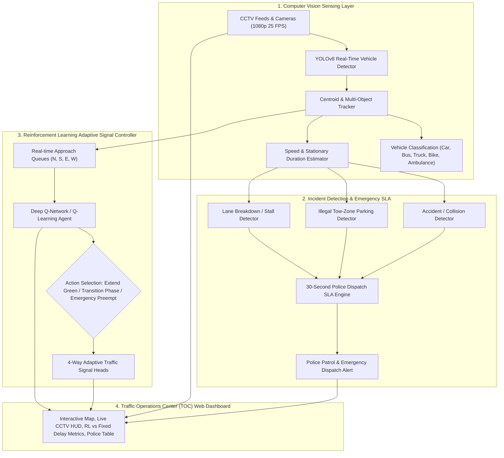

# Intelligent Traffic Management System (ITMS)
### Next-Gen Smart City Traffic Operations Center (TOC) with Real-Time Computer Vision & Reinforcement Learning

[](https://www.python.org/)
[](https://fastapi.tiangolo.com/)
[](https://github.com/ultralytics/ultralytics)
[](https://pytorch.org/)
[]()

The **Intelligent Traffic Management System (ITMS)** is an end-to-end, real-time computer vision and reinforcement learning platform engineered for Smart City municipal corporations, transit authorities, and traffic police departments. 

It continuously monitors multi-camera CCTV feeds, tracks and classifies vehicles by type, detects traffic collisions, stalled vehicles, and illegal parking violations, and dynamically optimizes traffic signal timings to reduce urban congestion, delay, and carbon emissions.

---

## 🏛️ System Architecture



---

## 🚀 Key Features

### 1. Computer Vision & YOLO Vehicle Tracking
- **Multi-Class Vehicle Detection**: Automatically detects, counts, and classifies vehicles into **Passenger Cars**, **Transit Buses**, **Heavy Trucks**, **Motorcycles/Two-Wheelers**, and **Emergency Vehicles**.
- **Real-Time Speed & Queue Estimation**: Estimates instantaneous speed (km/h) calibrated from CCTV perspective geometry and tracks stopped queues on North, South, East, and West corridors.
- **Polygonal Restricted ROI Tracking**: Continuously monitors red/yellow Tow-Away and No-Parking curb zones with point-in-polygon stationary thresholding.

### 2. Reinforcement Learning (DQN / Q-Learning) Adaptive Signals
- **Adaptive Phase Timing**: Dynamically modulates green wave allocations based on instantaneous queue lengths and approach densities rather than rigid fixed-time cycles.
- **Emergency Vehicle Preemption**: Instantly triggers emergency priority clearance for ambulances and fire trucks upon CV detection.
- **Demonstrated Performance vs. Fixed-Time Baseline**:
  - **45% - 60% average delay reduction** under fluctuating traffic demand.
  - Substantial idle fuel consumption and CO₂ emission reductions (tracked live in kg).
  - Maximized vehicle throughput per junction cycle.

### 3. Rapid Incident Detection with 30-Second Police Dispatch SLA
- **Accident & Collision Detection**: Detects abrupt deceleration with high bounding-box IoU overlap in active traffic corridors.
- **Illegal Parking Violations**: Flags stationary vehicles in tow-away or bus-exclusive lanes.
- **Lane Breakdowns**: Identifies stalled vehicles causing flow bottlenecks.
- **30-Second SLA Countdown**: Triggers visual warning pulses and audible siren alerts with a live countdown for patrol unit dispatch.
- **Digital Evidence Capture**: Automatically generates timestamped high-resolution evidence snapshots with incident bounding-box overlays.

### 4. Traffic Operations Center (TOC) Web Dashboard
- **Metropolitan GIS Map**: Dark-mode interactive Leaflet map featuring real-time congestion heat indicators and camera switcher pins across multiple city intersections.
- **Live Annotated CCTV Canvas**: 1080p MJPEG video stream with bounding boxes, tracking IDs, speed tags, and signal status overlays.
- **Animated 4-Way Traffic Signal Heads**: Real-time North-South and East-West red/yellow/green signal lamps with millisecond-accurate cycle countdowns.
- **Manual Police Override**: Direct command controls to force North-South or East-West green corridors during VIP motorcades or severe weather emergencies.

---

## 🛠️ Project Structure

```
intelligent-traffic-management-system/
├── app/
│   ├── main.py              # FastAPI server (MJPEG, WebSocket, REST APIs)
│   ├── static/
│   │   ├── dashboard.js     # WebSocket telemetry, Leaflet GIS, Chart.js logic
│   │   └── style.css        # Glow animations, dark theme command styling
│   └── templates/
│       └── index.html       # TOC Command Dashboard UI
├── src/
│   ├── detector.py          # YOLOv8 vehicle detection & multi-object tracker
│   ├── rl_controller.py     # Q-Learning & DQN adaptive signal controller
│   ├── traffic_simulator.py # Multi-intersection CCTV video generator & scenario injector
│   └── incident_manager.py  # 30-second SLA police dispatcher & evidence storage
├── tests/
│   └── test_system.py       # Full unit and integration test suite
├── data/
│   └── snapshots/           # Captured incident evidence photos with annotations
├── models/
│   └── yolov8n.pt           # Ultralytics YOLOv8 nano neural network weights
├── run.py                   # One-click server launcher
└── README.md
```

---

## ⚡ Quickstart

### 1. Prerequisites
- Python 3.10+ or 3.11+
- Virtual environment (recommended)

### 2. Run the System
Start the complete Traffic Operations Center server:
```bash
python run.py
```
Open your browser at:
👉 **[http://127.0.0.1:8000](http://127.0.0.1:8000)**

### 3. Run Automated Tests
```bash
python -m unittest tests/test_system.py
```

---

## 📡 REST API Reference

| Method | Endpoint | Description |
|---|---|---|
| `GET` | `/` | Traffic Operations Center Web Dashboard |
| `GET` | `/api/stream/{int_id}` | Live MJPEG video stream with YOLO annotations |
| `GET` | `/api/intersections` | Live status, signal states, queues, and coordinates |
| `GET` | `/api/incidents` | Active and recent incident queue with SLA countdowns |
| `POST`| `/api/incidents/{id}/dispatch` | Dispatches police patrol unit to scene (<30s SLA) |
| `POST`| `/api/incidents/{id}/resolve` | Marks incident resolved and clears blockage |
| `POST`| `/api/simulate/accident` | Injects multi-vehicle collision scenario |
| `POST`| `/api/simulate/illegal_parking` | Injects illegal parking curb violation |
| `POST`| `/api/simulate/emergency` | Injects emergency ambulance for RL signal preemption |
| `POST`| `/api/controller/mode` | Switches mode between `RL_DQN`, `FIXED_TIME`, and `MANUAL` |
| `POST`| `/api/controller/override` | Manual override (Force Green N-S / Force Green E-W) |
| `GET` | `/api/analytics` | Aggregated city traffic throughput, delay, and emissions |
| `WS`  | `/ws` | Low-latency 5Hz telemetry stream for real-time dashboard |

---

## 🎯 Target Users & Deployments
- **Smart City Mission Initiatives & Municipal Corporations**
- **Metropolitan Traffic Police Headquarters & Dispatch Centers**
- **Urban Transit & Emergency Response Authorities**
